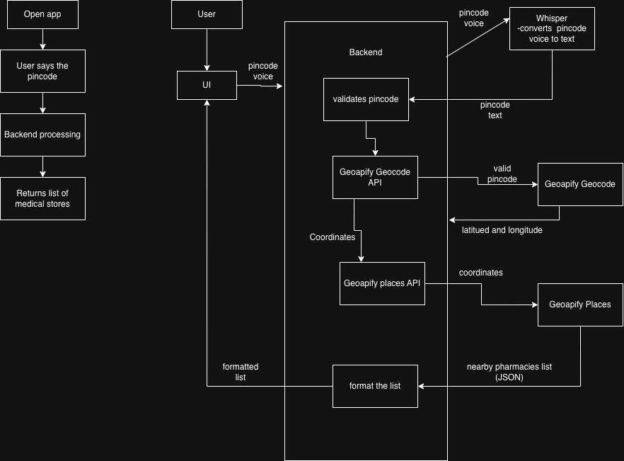
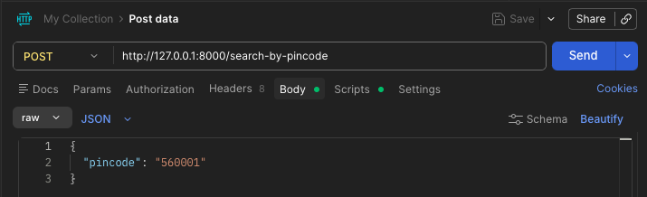
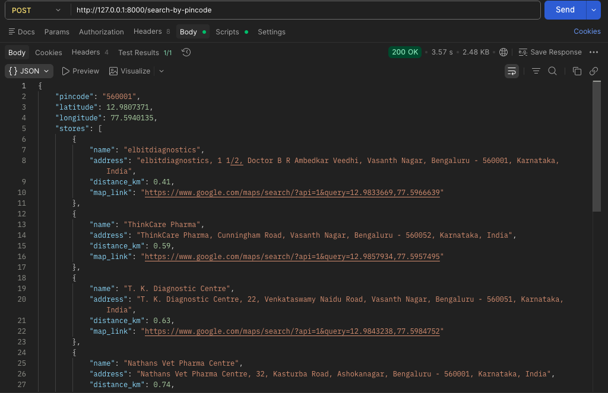
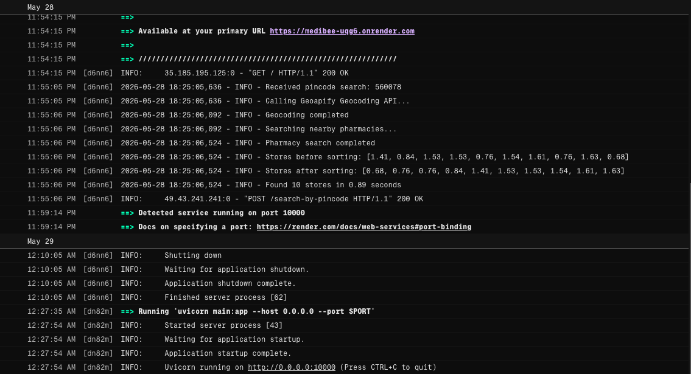

# 🐝 MediBee

MediBee is a modern full-stack medical store locator web application that helps users quickly find nearby pharmacies using either **text input** or **voice-based pincode detection**.

Built using **React + FastAPI**, the application supports real-time medical store search, distance calculation, Google Maps integration, CI/CD automation, and full cloud deployment.

---

# 🔗 One-Click Access

## 🌐 Live Frontend

Use the deployed MediBee application here:

https://medi-bee.vercel.app

Note: The deployed demo may not support voice input/output because the Azure Speech free-tier credits might have expired. The implementation and source code remain available in this repository.

---

## ⚙️ Live Backend API

Check the deployed FastAPI backend here:

https://medibee-uqg6.onrender.com

When opened, it should display:

```json
{
  "message": "Medical Store Locator API is running"
}
```

---

# ✨ Features

- 💊 Search nearby medical stores by pincode
- 🎤 Voice-based pincode detection
- 📍 Distance calculation from user location
- 🗺️ Google Maps integration
- 🌍 Real-time pharmacy search using Geoapify APIs
- 📱 Responsive modern UI
- ⚡ FastAPI backend APIs
- 🚀 Fully deployed frontend & backend
- 🔄 CI/CD pipeline with GitHub Actions
- 🧪 API testing using Postman
- ☁️ Vercel + Render deployment
- 📊 Backend logging and monitoring

---

# 🛠️ Tech Stack

| Category | Technologies | Version / Compatibility |
|---|---|---|
| Frontend | React.js, CSS3 | React 18+, Node.js 18+ |
| Backend | FastAPI, Python | FastAPI 0.115+, Python 3.11,3.12 |
| APIs | Geoapify API, OpenAI Whisper API | Latest Stable APIs |
| Deployment | Vercel, Render | Cloud Hosted |
| CI/CD | GitHub Actions | GitHub Actions v4 |
| Testing | Postman | Postman v10+ |
| Version Control | Git & GitHub | Git 2.30+ |
| Speech Recognition | Web Speech API | Chrome Browsers |
| Package Manager | npm, pip | npm 9+, pip 23+ |

---
# 🏗️ System Architecture



___
# 📌 MediBee Workflow

1.User opens the app.
2.User speaks a pincode/location.
3.Frontend sends voice input to backend.
4.OpenAI Whisper converts speech to text.
5.Backend validates the pincode/location.
6.Geoapify Geocoding API converts location to coordinates.
7.Geoapify Places API fetches nearby medical stores.
8.Backend formats the pharmacy list.
9.Frontend displays nearby pharmacies to the user.
___
# 📂 Project Structure

```bash
medical-store-app/
│
├── backend/
│   ├── main.py
│   ├── requirements.txt
│   └── .env
│
├── frontend/
│   ├── src/
│   ├── public/
│   ├── package.json
│   └── ...
│
└── .github/
    └── workflows/
```

---

# ⚙️ Setup Instructions
Follow the steps below carefully to run MediBee locally on your system.
___

# 1️⃣ Clone the Repository

First, open Terminal and run:

```bash
git clone https://github.com/NandithaNair19/MediBee.git
```

This downloads the complete project to your computer.

Now move into the project folder:

```bash
cd MediBee
```

---

# 📂 Project Structure

The project contains:

```bash
backend/   → FastAPI backend
frontend/  → React frontend
```

Both frontend and backend must run separately.

---

# 🔹 Backend Setup (FastAPI)

## Step 1 — Move into Backend Folder

```bash
cd backend
```

---

## Step 2 — Create Virtual Environment 

Create a Python virtual environment:

```bash
python3 -m venv venv
```

Activate it:

### macOS/Linux

```bash
source venv/bin/activate
```

After activation, your terminal should show:

```bash
(venv)
```

---

## Step 3 - Install Backend Dependencies

Install all required Python packages:

```bash
pip install -r requirements.txt
```

This installs:
- FastAPI
- Uvicorn
- Requests
- OpenAI SDK
- dotenv
- and other required libraries

---

## Step 4 — Create `.env` File

Inside the `backend` folder, create a file named:

```bash
.env
```

Add the following:

```env
OPENAI_API_KEY=your_openai_api_key
GEOAPIFY_API_KEY=your_geoapify_api_key
```

### Where to get the keys?

The application requires two API keys to work properly.

---

## 1️⃣ OpenAI API Key (For Voice Transcription)

MediBee uses **OpenAI Whisper API** to convert user speech into text for voice-based pincode detection.

### Steps to get the API key:

1. Go to:

```text
https://platform.openai.com/signup
```

2. Create an OpenAI account or log in.

3. After logging in, open:

```text
https://platform.openai.com/api-keys
```

4. Click:

```text
Create new secret key
```

5. Copy the generated API key.

Example:

```text
sk-xxxxxxxxxxxxxxxx
```

6. Paste it into your `.env` file:

```env
OPENAI_API_KEY=sk-xxxxxxxxxxxxxxxx
```

### Note
- OpenAI usage is pay-as-you-go.
- Whisper transcription cost is very low for demo/testing usage.

---

## 2️⃣ Geoapify API Key (For Pharmacy Search & Geocoding)

MediBee uses **Geoapify APIs** to:
- convert pincodes into coordinates
- search nearby medical stores
- calculate nearby pharmacy results

### Steps to get the API key:

1. Go to:

```text
https://www.geoapify.com/
```

2. Create a free account.

3. After logging in, open the dashboard.

4. Create a new project/app.

5. Generate an API key.

6. Copy the API key.

7. Paste it into your `.env` file:

```env
GEOAPIFY_API_KEY=123abcxyz
```

### Note
Geoapify provides a free tier sufficient for development and testing.

---

## Step 5 — Run Backend Server

Start the FastAPI backend:

```bash
python3 -m uvicorn main:app --reload
```

If successful, you should see:

```bash
Uvicorn running on http://127.0.0.1:8000
```

Backend now runs at:

```bash
http://127.0.0.1:8000
```

---

# 🔹 Frontend Setup (React)

Open a NEW terminal window while keeping backend running.

---

## Step 1 — Move into Frontend Folder

From project root:

```bash
cd frontend
```

---

## Step 2 — Install Frontend Dependencies

Install all required npm packages:

```bash
npm install
```

This installs:
- React
- React scripts
- required frontend libraries
- dependencies from package.json

---

## Step 3 — Start React Frontend

Run:

```bash
npm start
```

After a few seconds, browser automatically opens:

```bash
http://localhost:3000
```

---

# 🚀 Running the Full Application

You MUST keep BOTH running:

| Terminal | Purpose |
|---|---|
| Terminal 1 | FastAPI Backend |
| Terminal 2 | React Frontend |

---

# ✅ How to Use MediBee

1. Open the frontend in browser
2. Click **Get Started**
3. Choose:
   - Type Pincode
   - OR Speak Pincode
4. Enter/speak valid pincode
5. Allow location permission if prompted
6. Nearby medical stores will appear
7. Click **Open in Google Maps** for navigation

---

# 🎤 Voice Search Notes

- Voice input works best on **Google Chrome**
- Browser microphone permission must be allowed
- Users can directly speak their pincode

Example:

```text
560103
```

---

# 🧪 Backend Testing

The backend APIs can be tested using **Postman**  before running the frontend.

---

## 🔹 Testing with Postman

### Step 1 — Open Postman

Download and install Postman from:

```text
https://www.postman.com/downloads/
```

---

### Step 2 — Create a New Request

1. Open Postman
2. Click **New Request**
3. Set request type to:

```text
POST
```

4. Enter the API URL:

```text
http://127.0.0.1:8000/search-by-pincode
```

---

### Step 3 — Add Headers

Go to the **Headers** tab and add:

| Key | Value |
|---|---|
| Content-Type | application/json |

---

### Step 4 — Add Request Body

1. Open the **Body** tab
2. Select:

```text
raw
```

3. Choose:

```text
JSON
```

4. Paste:

```json
{
  "pincode": "560103",
  "user_lat": 12.9716,
  "user_lon": 77.5946
}
```

---

### Step 5 — Send Request

Click:

```text
Send
```

If successful, the API returns nearby medical stores in JSON format.

---

## Example Response

```json
{
  "stores": [
    {
      "name": "Apollo Pharmacy",
      "address": "Bangalore, Karnataka",
      "distance_km": 1.4
    }
  ]
}
```
## Postman Request



---

## Postman Response



---

# 🚀 Deployment

## Frontend

Deployed using **[Vercel](VERCEL_DEPLOYMENT.md)**

## Backend

Deployed using **[Render](RENDER_DEPLOYMENT.md)**

## CI/CD

Every push to the `main` branch automatically:

- triggers GitHub Actions
- builds the frontend
- redeploys the latest version

For detailed deployment steps, refer to:

- [Frontend Deployment Guide - Vercel](VERCEL_DEPLOYMENT.md)
- [Backend Deployment Guide - Render](RENDER_DEPLOYMENT.md)
---

# 📊 Monitoring & Logs

Backend logs include:

- incoming requests
- API call timings
- pharmacy search status
- response times
- error tracking

Production logs can be monitored directly from the Render dashboard.


## Backend Monitoring Example


---
# 💰 Estimated Cost

| Service | Purpose | Estimated Cost |
|---|---|---|
| Vercel | Frontend Hosting | Free Tier |
| Render | Backend Hosting | Free Tier |
| Geoapify API | Pharmacy Search & Geocoding | Free Tier Available |
| OpenAI Whisper API | Voice Transcription | Usage-based (~$0.50 for 500 requests per month) |
| GitHub Actions | CI/CD Pipeline | Free Tier |


OpenAI Whisper API pricing is based on **audio duration**, not tokens.

Current pricing:

```text
$0.006 per minute of audio
```

---

Assuming:

- average voice input = 10 seconds
- 500 requests per month

Calculation:

```text
500 × 10 seconds = 5000 seconds
≈ 83.3 minutes
```

Estimated cost:

```text
83.3 × $0.006
≈ $0.50/month
```
✅ Approximate Usage Cost

| Monthly Requests | Estimated Cost |
|---|---|
| 100 requests | ~$0.10 |
| 500 requests | ~$0.50 |
| 1000 requests | ~$1.00 |

---
## 🚀 Run Locally (One Click)

1. Download the zip from the releases page
2. Unzip it
3. **Mac/Linux:** Double-click `start.sh`  
   **Windows:** Double-click `start.bat`
4. Enter your API keys when prompted
5. Open http://localhost:3000 in your browser

### You'll need:
- [Node.js](https://nodejs.org) installed
- [Python 3.11+](https://python.org) installed
- An OpenAI API key
- A Geoapify API key

---

# 📌 Note

Since MediBee only processes short pincode voice inputs, Whisper API costs remain very low for demo and student-scale usage.
___

# 🔮 Future Improvements

- 🌐 Multilingual voice support
- 🧠 Automatic language detection
- 📍 Live GPS-based nearby pharmacy detection
- 💬 AI chatbot assistance
- 📲 Mobile app version
- 🕒 24/7 emergency pharmacy filtering

---

# 👩‍💻 Author

Built by **Nanditha Nair**
